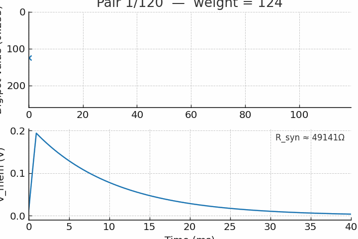

# Analog LIF Neuron with STDP — Project

**Compact, hands-on neuromorphic hardware prototype** — this repository contains a small analog LIF (leaky integrate-and-fire) neuron implemented with discrete components, a synapse realized with a digital potentiometer, and a microcontroller implementing an STDP (spike-timing-dependent plasticity) update rule. The goal: a reproducible, educational demonstration of synaptic plasticity that is feasible on a hobbyist budget while being challenging and research-adjacent.

## Highlights / What you'll find here
- `arduino_stdp_mcp41x.ino` — Arduino firmware that detects pre/post spikes and updates an MCP41x-style digipot via SPI.
- `neuron.cir` — NGSpice netlist for a simplified LIF neuron (for parameter exploration).
- `serial_plot.py` — Python tool for serial logging and visualization.
- `results/` — simulated STDP experiment outputs (plots, traces, CSVs).
- `LICENSE` — MIT.

## Simulated results (included)
The `results/` folder contains outputs from a simple STDP simulation (paired pre→post at dt=+10 ms):
- `weight_log.csv` — digipot value per pairing (0..255; lower = stronger synapse)
- `weight_evolution.png` — plot of weight vs. pair index
- `membrane_initial.png`, `membrane_final.png` — membrane voltage response to a single pre-spike for the initial (w=128) and final (w=0) weights
- `membrane_initial.csv`, `membrane_final.csv` — numeric traces
- `summary.txt` — short summary and observations

**Quick observation:** under the chosen pairing protocol (120 pre→post pairs, dt=+10 ms) the synaptic weight moves toward stronger potentiation (digipot value decreases), and the simulated membrane response amplitude increases accordingly.

## How to reproduce the simulation locally
Requirements: Python 3.8+, NumPy, Matplotlib.

```bash
python3 -m venv venv
source venv/bin/activate
pip install numpy matplotlib
python3 serial_plot.py  # for serial logging (if you have hardware)
# The simulation that produced the files in /results is included as a script in this repo.
```

## PCB / Hardware notes
- The analog front-end is designed for single-supply 5V operation (use op-amps that support 5V rails, e.g., MCP6002).
- Keep analog traces short, use decoupling capacitors, and separate analog/digital grounds.
- The digipot (MCP41x family) in series with the synapse allows programmable resistance; ensure SPI level compatibility.

<p align="center">
  
  <br>
  <em>Figure — STDP paired pre→post protocol: weight (top) and membrane response (bottom).</em>
</p>

## License & Contribution
MIT License — contributions welcome.
